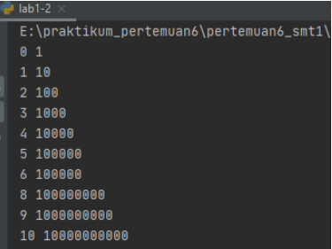

# pertemuan6_smt1
Repository ini di buat untuk memenuhi tugas bahasa pemrograman pertemuan ke 6 <br>
Nama  : Indira Aline <br>
Nim   : 312010042 <br>
Kelas : TI.20 A.1 <br>

DAFTAR ISI
| No | Description | Link |
| ----- | ----- | ----- |
| 1 | Tugas Pertemuan 5 | [click here](#pertemuan-5---tugas)
| 2 | Tugas Pertemuan 6 - Lab 1 | [click here](#pertemuan-6---lab-1)
| 3 | Tugas Pertemuan 6 - Lab 1-2 | [click here](#pertemuan-6---lab-1-2)
| 4 | Tugas Pertemuan 6 - Lab 2 | [click here](#pertemuan-6---lab-2)
 
## Pertemuan 5 - Tugas

Pada pertemuan 5 Bahasa Pemrograman saya diberi tugas oleh Dosen untuk membuat Aplikasi Biodata Python (seperti Gambar dibawah ini)
 <br>

Saat ini saya akan menjelaskan hasil dari tugas tersebut. <br>
Berikut source code nya atau Klik Link berikut <br>
): <br>
 ``` python
print("==============================")
print("= NAMA    : Indira Aline     ")
print("= NIM     : 312010042         ")
print("= KELAS   : TI.20 A.1         ")
print("==============================")

print("Please enter your full name : ")
fullname=input()
print("Please enter nickname : ")
nickname=input()
print("Please enter your NPM : ")
npm=int(input())
print("Please enter place of birth : ")
pob=input()
print("Please enter date of birth : ")
date=int(input())
print("Please enter your month of birth : ")
month=input()
print("Please enter year of birth : ")
year=int(input())
print("Please enter your phone number : ")
phone=int(input())
print("Please enter your address : ")
address=input()

dob=2020-year

print("\n\n Assalamu'alaikum. ")
print(f"Let me introduce my self, my name is {fullname}, but you can call me {nickname}, my NPM {npm}, I was born in {pob} and iam {dob} years old, I am very glad if you want to invite my house in {address}, So don't forget to call me before with the number {phone}, \n\n Thanks you ")

```
Berikut Penjelasannya : <br>
```python
print("please enter your full name : ")

```
Source code diatas berfungsi untuk mencetak hasil / output berupa *Please enter your full name :* ". <br>
 Untuk menampilkan output string, saya menggunakan tanda petik dua didalam fungsi print(), sedangkan jika saya ingin menampilkan output atau hasil berupa angka atau interger saya tidak perlu menggunakan tanda petik dua. Contohnya :
 
 ```python
print("Nama saya adalah...")
print(1234567)

```
(Seperti gambar dibawah ini) <br>
 <br>

* Untuk source code berikutnya adalah inputan atau membuat variable. seperti syntax dibawah ini : <br>
```python
fullname=input()

```
Keterangan : <br> 
>Variable adalah sebuah wadah penyimpanan data pada program yang akan akan digunakan selama program itu berjalan. yang berfungsi sebagai variable dalam source code diatas adalah *fullname* . <br>
>Fungsi *input()* adalah untuk memasukan nilai dari layar console di command prompt, lalu kemudian mengembalikan nilai saat kita menekan tombol enter (newline)<br> 
 (newline)<br>

[input](Foto/gitfullname.PNG)
Pada gambar di atas, hasil dari inputan tersebut berwarna hijau <br>

* Untuk memasukan perintah lain seperti Nikname, NPM, Place Of Birth, Date Of Birth, Year Of Birth, Phone Number, and Addres mengikuti perintah sama seperti memasukan fullname <br>

* Untuk menghitung rumus saya menggunakan variable DOB yaitu 2020 (Tahun sekarang) dikurangin dengan Year of Birt, pada source code berikut :<br>

```python
dob=2020-year

```

Pada syntax/source diatas, saya menggunakan variable (dob) dimana untuk menghitung umur (variable *age* pada output), yaitu dengan rumus pada variable dob=2020-year
<br>

* langkah kali ini saya akan menampilkan output yang diminta oleh dosen.<br>
output pertama yang diminta Dosen adalah menampilkan salam, yaitu dengan mengetikkan syntax/source code berikut : 
```python
print("\n\n Assalamu'alaikum. ")

```
Keterangan :
1. Fungsi *\n* pada source code di atas adalah untuk memberi baris baru / enter / (newline)
2. Fungsi print() seperti dijelaskan pada point *Output* diatas
Hasil dari source code diatas adalah seperti gambar dibawah ini :<br>
 <br>

```python
print(f"Let me introduce my self, my name is {fullname}, but you can call me {nickname}, my NPM {npm}, I was born in {pob} and iam {dob} years old, I am very glad if you want to invite my house in {address}, So don't forget to call me before with the number {phone}, \n\n Thanks you ")
```

Keterangan : 
1. Fungsi huruf *f* pada perintah print(f"....") adalah fungsi print atau bisa memudahkan programer dalam mencetak statement dalam satu baris dibandingkan dengan metode yang lama yaitu memisahkan string dan variable dengan simbol koma( , ) atau plus ( + )<br>
2. sedangkan fungsi {} pada output tersebut adalah untuk menampilkan hasil dari variable <br>
Hasil dari output tersebut seperti berikut : <br>
 <br>

<br>
---
<br>

## Pertemuan 6 - Lab 1

Pada halaman ini (Tugas Pertemuan 6 - Lab 1) saya diberikan tugas oleh Dosen yaitu mempelajari operator aritmatika menggunakan bahasa Pemrograman pyhton. Berikut source code yang di berikan oleh dosen :

```python

#penggunaan end
print('A', end='')
print('B', end='')
print('C', end='')
print()
print('X')
print('Y')
print('z')

#penggunaan separator
w, x, y, z = 10, 15, 20, 25
print(w, x, y, z)
print(w, x, y, z, sep=',')
print(w, x, y, z, sep='')
print(w, x, y, z, sep=':')
print(w, x, y, z, sep='.....')

```

Oke, kali ini saya akan menjelaskan tentang materi yang di berikan oleh Dosen. <br>

*Penggunaan END
Penggunaan end digunakan untuk menambahkan karakter yang dicetak di akhir baris. secara default penggunaan end adalah untuk ganti baris. <br>

```python  
print('A', end='')
print('B', end='')
print('C', end='')

```

> Penggunaan print () digunakan untuk mencetak output, seperti syntax dibawah ini :

```python
print()

```

>Syntax dibawah ini digunakan untuk menampilkan output berupa string
```python
print('X')
print('Y')
print('z')

```

Hasil dari source code tersebut seperti gambar dibawah ini : <br>
 <br>

* Penggunaan separator

>Pendeklarasian beberapa variable beserta nilainya
```python
w,x,y,z=10,15,20,25
```

>Menampilkan hasil dari variable tiap-tiap variable
```python
print(w,x,y,z)
```

>Menampilkan hasil dari tiap-tiap variable dengan menggunakan pemisah : (koma)
```python
print(w,x,y,z,sep=",")

```
>Menampilkan hasil dari tiap-tiap variable dengan menggunakan pemisah

```python
print(w,x,y,z,sep="")

```

>Menampilkan hasil dari tiap-tiap variable dengan menggunakan pemisah : (titik dua)
```python
print(w,x,y,z,sep=":")

```
>Menampilkan hasil dari tiap-tiap variable dengan menggunakan pemisah -----
```python
print(w,x,y,z,sep="-----")`

```

hasil dari syntax / source code diatas adalah seperti berikut ini : <br>
 <br>


<br>
<hr>
<br>

## Pertemuan 6 - Lab 1-2

* String Format<br>
String formatting atau pemformatan string memungkinan kita menyuntikkan item kedalam string dari pada kita mencoba menggabungkan string menggunakan koma atau string concatenation.<br>

Penggunaan source code yang di berikan oleh dosen seperti berikut :
 <br>

```python
#string format 1
print(0, 10**0)
print(1, 10**1)
print(2, 10**2)
print(3, 10**3)
print(4, 10**4)
print(5, 10**5)
print(6, 10**5)
print(8, 10**8)
print(9, 10**9)
print(10, 10**10)

#string format 2
print('{0:>3} {1:>16}'.format(0, 10**0))
print('{0:>3} {1:>16}'.format(1, 10**1))
print('{0:>3} {1:>16}'.format(2, 10**2))
print('{0:>3} {1:>16}'.format(3, 10**3))
print('{0:>3} {1:>16}'.format(4, 10**4))
print('{0:>3} {1:>16}'.format(5, 10**5))
print('{0:>3} {1:>16}'.format(6, 10**6))
print('{0:>3} {1:>16}'.format(7, 10**7))
print('{0:>3} {1:>16}'.format(8, 10**8))
print('{0:>3} {1:>16}'.format(9, 10**9))
print('{0:>3} {1:>16}'.format(10, 10**10))

```

<br>

Saat ini saya akan membahas satu persatu dari syntax yang telah diberikan oleh Dosen.<br>
1. *String Format 1* <br>
Pada syntax / source code strring format satu akan menampilkan output berupa 2 outputan.<br>
Yang pertama (sebelah kiri) akan menampilkan angka urut dari angka 0 hingga 10, sedangkan untuk sebelah kanan akan menampilkan Operasi Aritmatika Pangkat.<br> 
Dengan ketentuan sebagai berikut, Operasi pangkat dengan angka kiri sebagai pokok (Rumus : ** [bintang dua] )<br>
Hasil dari syntax tersebut adalah 10 pangkat 0, hingga 10 pangkat 10, dengan output  sebagai berikut : <br>
 <br>

2 * String Format 2* <br>
 Pada syntax atau source code string format dua akan menampilkan output berupa 2 output'an juga (seperti String Format 1, yaitu kanan dan kiri )<br>
 Dengan ketentuan sebagai berikut : <br>
 >secara Default, *.format()* menggunakan rata kiri, angka ke kanan. kita dapat menggunakan opsi opsional <,^, atau > untuk mengatur perataan kiri, tengah, atau kanan. Contoh lain dalam penggunaan *.format()* sebagai berikut :<br> 

```python
print('{0:8} | {1:9}'.format('buah','Jumlah'))
print('{0:8} | {1:9}'.format('Apel',3.))
print('{0:8} | {1:9}'.format('Jeruk',10))
```

Hasil dari source code contoh diatas akan seperti berikut :<br>
 <br>

>Secara Default,*.format()* menggunakan rata text ke kiri, angka ke kanan, kita dapat menggunakan opsi opsional<,^,atau > untuk mengatur perataan kiri, tengah, atau kanan. Contoh lain dalam penggunaan *.format()* sebagai berikut : <br>
```python
print('{:<30}{:30}{:>30}'.format('kiri','tengah','kanan'))
print('{:<30}{:30}{:>30}'.format(7,20,34))
```

Hasil dari source code contoh diatas akan muncul seperti ini :<br>
 <br>

<br><br>
Untuk hasil dari String Format 2 adalah :<br>
 <br>

<br><hr><br>

## pertemuan 6 - Lab 2
* Konversi Nilai Variable <br>
Untuk pembahasan terakhir, kali ini akan menyelesaikan tugas Lab 2 dari Dosen, yaitu konversi Nilai Variable<br>
Tugas
 <br> 

```python
a=input("masukkan nilai a : ")
b=input("masukkan nilai b : ")
print("variable a : ",a)
print("variable b : ",b)
print("hasil penggabungan {1}&{0}=%d".format(a,b) %(a+b))

#konversi nilai variable
a=int(a)
b=int(b)
print("hasil pejumlahan {1}+{0}=%d".format(a,b) %(a+b))
print("hasil pembagian {1}/{0}=%d".format(a,b) %(a/b))
```

<br>
Setelah saya menjelaskan source code tersebut terdapat error, seperti gambar dibawah ini :<br>

 <br>
Nah, untuk kali ini kita akan membaca error yang telah terjadi.<br>
> *TypeError: %d format: a  number is required, not str* <br>

Pada error tersebut terdapat terbaca bahwa variable tersebut a adalah string, yang seharusnya dibaca oleh system adalah Number / Interger.<br>
bagaimana cara memperbaiki error tersebut?<br>
Kita lihat pada baris ke 5 (di notifikasi terbaca bahwa error terletak pada baris ke 5), yaitu pemformatan *.format()* adalah interger, sedangkan jika berupa string maka akan ada tanda titik dua ("..") pada pemformatan *.format()*<br>
Kita akan terfokus pada variable a dan b. <br> 
Pada line 1 tertulis syntax : a=input("masukan nilai a : ") <br>
Sedangkan pada line 2 tertulis syntax : b=input("masukan nilai b : ") <br>
Untuk membuat inputan berupa interger/angka harus ditambahkan syntax int() pada format input(). yang seharusnya ditulis adalah : <br>
```python
a=int(input("masukkan nilai a:"))
b=int(input("masukkan nilai b:"))
```

<br>
Kita akan ulangi semua syntax pada file ini, maka tulis seperti ini : <br>

```python
a=int(input("masukkan nilai a:"))
b=int(input("masukkan nilai b:"))
print("variable a=",a)
print("variable b=",b)
print("hasil penggabungan {1}&{0}=%d".format(a,b) %(a+b))

#konversi nilai variable
a=int(a)
b=int(b)
print("hasil pejumlahan {1}+{0}=%d".format(a,b) %(a+b))
print("hasil pembagian {1}/{0}=%d".format(a,b) %(a/b))
```
Kita akan coba lagi untuk run file tersebut, maka akan muncul seperti gambar dibawah ini :<br>

<br><br>
 <hr>
 Setelah semua file berhasil disimpan dan dijalankan berhasil, maka selesai sudah Tugas pertemuan 6 - Bahasa pemrograman kali ini.
 <br>
 
 ### ============= THANK YOU ============= <br>
 ### INDIRA ALINE / 312010042 / TI.20 A.1 <br>
 ### ===================================== <br>
